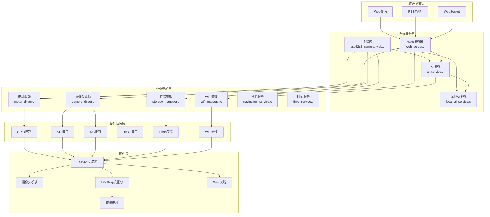
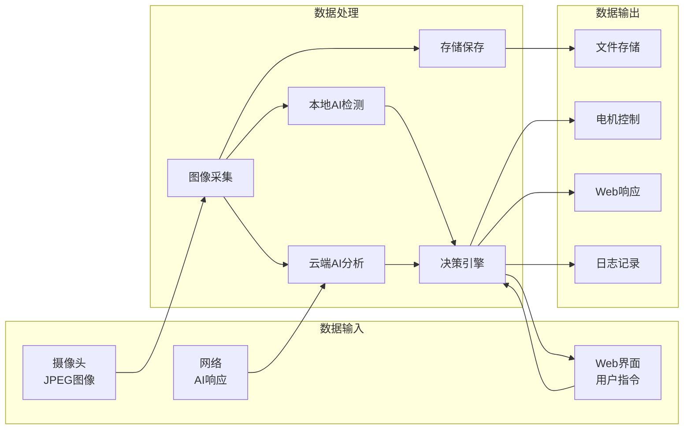
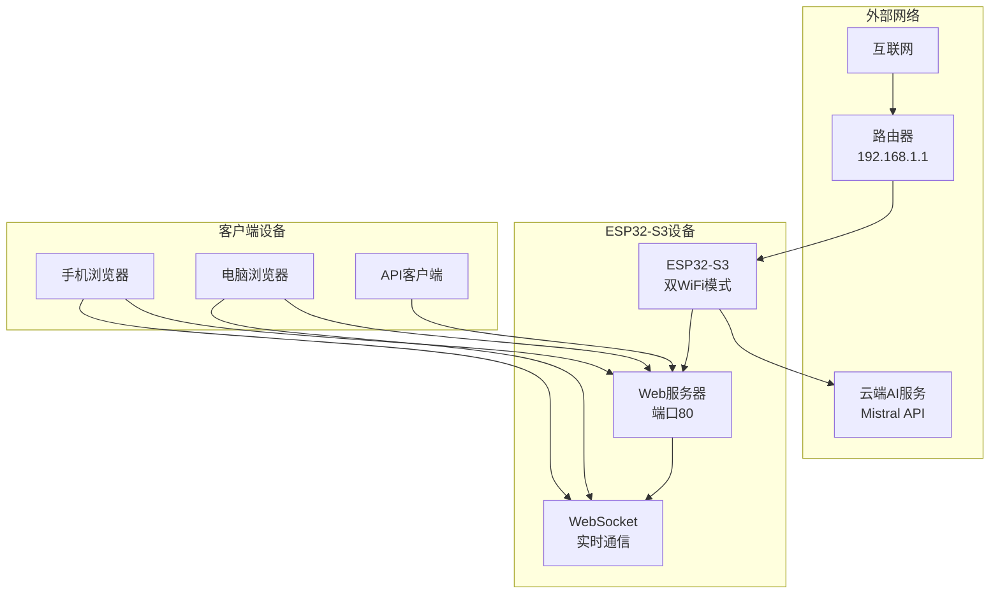
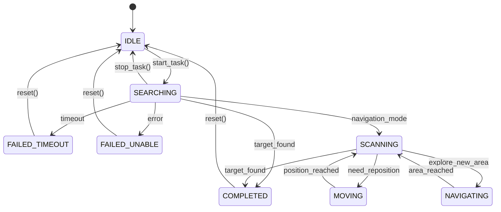
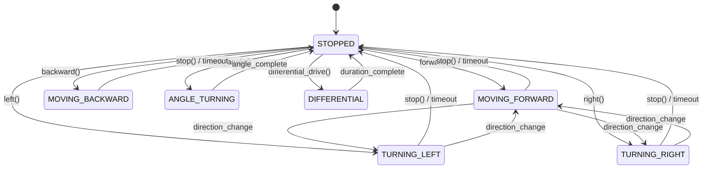
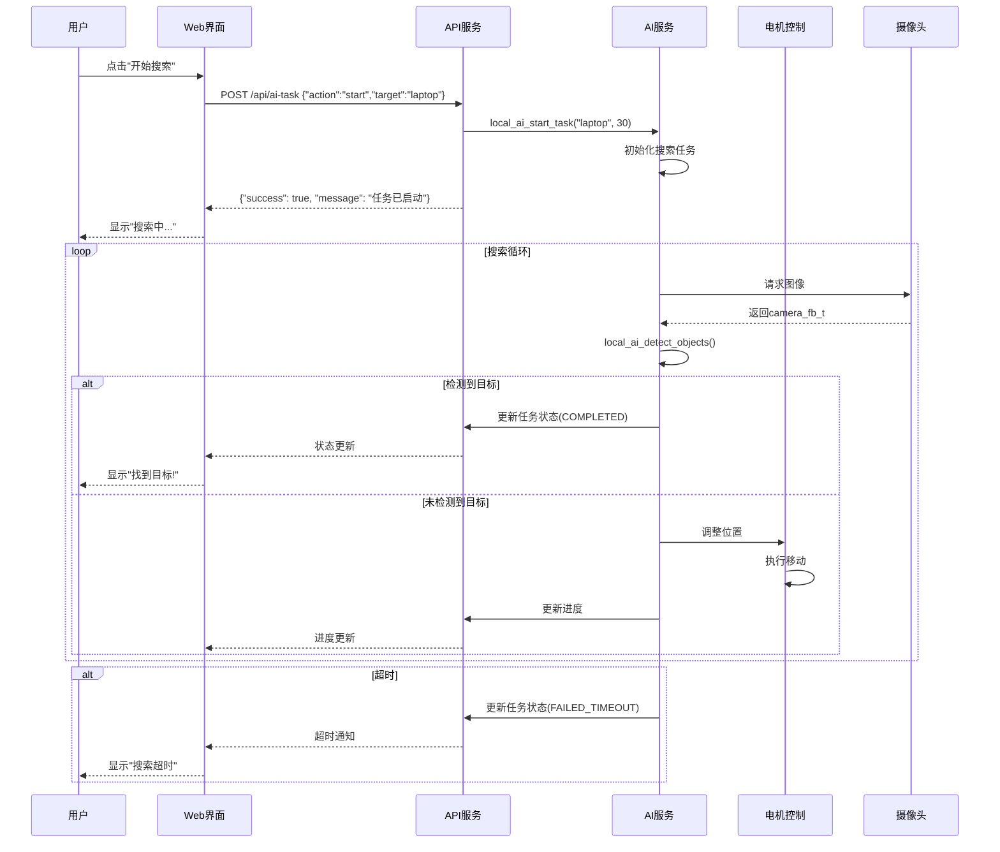
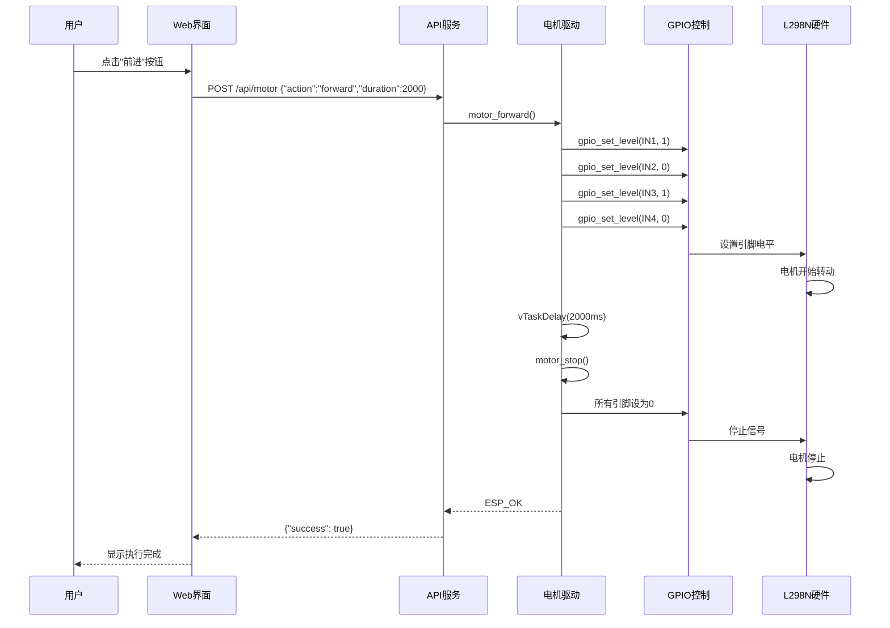
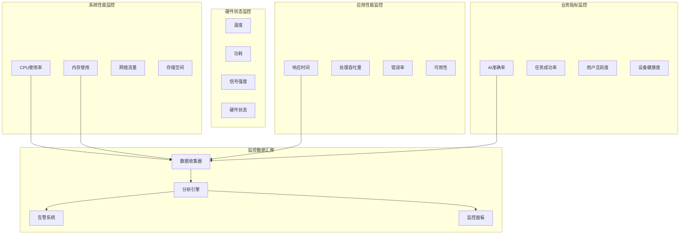

# ESP32-S3摄像头AI分析系统 - 架构图和数据流图

## 概述

本文档提供了ESP32-S3摄像头AI分析系统的详细架构图和数据流图，帮助开发者理解系统的整体设计和各组件之间的交互关系。

## 1. 系统整体架构图

### 1.1 分层架构图



### 1.2 组件依赖关系图

```
┌─────────────────────────────────────────────────────────────────┐
│                        ESP32-S3 主控制器                         │
├─────────────────────────────────────────────────────────────────┤
│  main/esp32s3_camera_web.c (主程序入口)                          │
│  ├── 系统初始化                                                   │
│  ├── FreeRTOS任务管理                                            │
│  └── 核心业务循环                                                 │
├─────────────────┬───────────────┬───────────────┬─────────────────┤
│   Web服务器     │    AI服务     │   电机驱动    │   摄像头驱动    │
│  web_server.c   │ ai_service.c  │motor_driver.c │camera_driver.c  │
│  ├── HTTP服务   │ ├── 云端AI    │ ├── L298N控制 │ ├── 图像采集    │
│  ├── API端点    │ ├── 本地AI    │ ├── 精确控制  │ ├── 参数配置    │
│  ├── WebSocket  │ ├── Tool Call │ ├── 差速驱动  │ └── 格式转换    │
│  └── 静态文件   │ └── 决策分析  │ └── 角度控制  │                 │
├─────────────────┼───────────────┼───────────────┼─────────────────┤
│   WiFi管理      │   存储管理    │   导航服务    │   时间服务      │
│ wifi_manager.c  │storage_mgr.c  │navigation.c   │time_service.c   │
│ ├── AP模式      │ ├── SPIFFS    │ ├── 路径规划  │ ├── NTP同步     │
│ ├── STA模式     │ ├── 图像存储  │ ├── 区域搜索  │ ├── 时间戳      │
│ ├── 双模式      │ ├── 文件管理  │ └── 避障逻辑  │ └── 定时任务    │
│ └── 网络监控    │ └── 元数据    │               │                 │
├─────────────────┴───────────────┴───────────────┴─────────────────┤
│                        硬件抽象层                                 │
├─────────────┬─────────────┬─────────────┬─────────────┬─────────────┤
│    GPIO     │     SPI     │     I2C     │    UART     │   Flash     │
│   控制      │    接口     │    接口     │    接口     │   存储      │
└─────────────┴─────────────┴─────────────┴─────────────┴─────────────┘
```

## 2. 数据流图

### 2.1 主要数据流程图



### 2.2 AI分析数据流

```
摄像头图像采集流程：
┌─────────────┐    ┌─────────────┐    ┌─────────────┐
│   摄像头    │───→│  图像缓冲区  │───→│  JPEG编码   │
│  (硬件)     │    │camera_fb_t  │    │   数据      │
└─────────────┘    └─────────────┘    └─────────────┘
                                              │
                                              ▼
┌─────────────┐    ┌─────────────┐    ┌─────────────┐
│  文件存储   │◄───│  存储管理   │◄───│  图像数据   │
│  (SPIFFS)   │    │   模块      │    │   处理      │
└─────────────┘    └─────────────┘    └─────────────┘
                                              │
                                              ▼
                            ┌─────────────────────────────┐
                            │        AI分析分支           │
                            └─────────────────────────────┘
                                    │                │
                                    ▼                ▼
                        ┌─────────────┐    ┌─────────────┐
                        │   本地AI    │    │   云端AI    │
                        │    检测     │    │    分析     │
                        └─────────────┘    └─────────────┘
                                    │                │
                                    ▼                ▼
                        ┌─────────────┐    ┌─────────────┐
                        │  特征检测   │    │ Base64编码  │
                        │  (颜色/形状) │    │  HTTP请求   │
                        └─────────────┘    └─────────────┘
                                    │                │
                                    ▼                ▼
                        ┌─────────────┐    ┌─────────────┐
                        │  检测结果   │    │  JSON解析   │
                        │detection_t  │    │ Tool Call   │
                        └─────────────┘    └─────────────┘
                                    │                │
                                    └────────┬───────┘
                                             ▼
                                  ┌─────────────────┐
                                  │    决策融合     │
                                  │   (优先本地)    │
                                  └─────────────────┘
                                             │
                                             ▼
                                  ┌─────────────────┐
                                  │    执行动作     │
                                  │  (电机控制)     │
                                  └─────────────────┘
```

### 2.3 电机控制数据流

```
电机控制指令流程：
┌─────────────┐    ┌─────────────┐    ┌─────────────┐
│  Web界面    │───→│  HTTP API   │───→│  JSON解析   │
│   用户      │    │   请求      │    │   参数      │
└─────────────┘    └─────────────┘    └─────────────┘
                                              │
┌─────────────┐    ┌─────────────┐    ┌─────────────┐
│  AI决策     │───→│ Tool Call   │───→│  动作指令   │
│   引擎      │    │   执行      │    │   解析      │
└─────────────┘    └─────────────┘    └─────────────┘
                                              │
                                              ▼
                            ┌─────────────────────────────┐
                            │       电机控制分发          │
                            └─────────────────────────────┘
                                    │        │        │
                                    ▼        ▼        ▼
                        ┌─────────────┐ ┌─────────────┐ ┌─────────────┐
                        │  基础控制   │ │  角度控制   │ │  差速控制   │
                        │forward/back │ │turn_angle   │ │differential │
                        └─────────────┘ └─────────────┘ └─────────────┘
                                    │        │        │
                                    └────────┼────────┘
                                             ▼
                                  ┌─────────────────┐
                                  │   GPIO控制      │
                                  │ (IN1/IN2/IN3/IN4)│
                                  └─────────────────┘
                                             │
                                             ▼
                                  ┌─────────────────┐
                                  │   L298N驱动     │
                                  │   (硬件)        │
                                  └─────────────────┘
                                             │
                                             ▼
                                  ┌─────────────────┐
                                  │   直流电机      │
                                  │  (左轮/右轮)    │
                                  └─────────────────┘
```

## 3. 任务调度图

### 3.1 FreeRTOS任务架构

```mermaid
gantt
    title ESP32-S3 FreeRTOS任务调度
    dateFormat X
    axisFormat %s
    
    section 高优先级任务(5)
    图像采集分析任务    :active, task1, 0, 3600
    Web服务器任务      :active, task2, 0, 3600
    
    section 中优先级任务(3-4)
    AI处理任务         :active, task3, 0, 3600
    WiFi管理任务       :active, task4, 0, 3600
    
    section 低优先级任务(1-2)
    电机测试任务       :task5, 5, 10
    存储清理任务       :task6, 0, 3600
    系统监控任务       :active, task7, 0, 3600
```



### 3.2 任务间通信图

```
任务间通信机制：
┌─────────────────┐    ┌─────────────────┐    ┌─────────────────┐
│  主分析任务     │    │   Web服务器     │    │   AI处理任务    │
│capture_analyze  │    │   web_server    │    │  ai_processing  │
│   (优先级5)     │    │   (优先级5)     │    │   (优先级4)     │
└─────────────────┘    └─────────────────┘    └─────────────────┘
         │                       │                       │
         ▼                       ▼                       ▼
┌─────────────────────────────────────────────────────────────────┐
│                      共享资源和通信机制                          │
├─────────────────┬─────────────────┬─────────────────┬─────────────────┤
│   互斥锁        │    队列         │   信号量        │   共享内存      │
│camera_mutex     │  command_queue  │  sync_sem       │  status_data    │
│motor_mutex      │  result_queue   │  ready_sem      │  config_data    │
│storage_mutex    │  event_queue    │  complete_sem   │  metrics_data   │
└─────────────────┴─────────────────┴─────────────────┴─────────────────┘
         ▲                       ▲                       ▲
         │                       │                       │
┌─────────────────┐    ┌─────────────────┐    ┌─────────────────┐
│  电机控制任务   │    │  存储管理任务   │    │  系统监控任务   │
│ motor_control   │    │storage_manager  │    │system_monitor   │
│   (优先级3)     │    │   (优先级2)     │    │   (优先级1)     │
└─────────────────┘    └─────────────────┘    └─────────────────┘
```

## 4. 内存布局图

### 4.1 ESP32-S3内存分配

```
ESP32-S3内存布局 (总计8MB Flash + 512KB SRAM):
┌─────────────────────────────────────────────────────────────────┐
│                        Flash存储 (8MB)                          │
├─────────────────┬─────────────────┬─────────────────┬─────────────────┤
│   Bootloader    │   应用程序      │    SPIFFS       │    保留区域     │
│    (64KB)       │   (1.6MB)       │   (320KB)       │   (剩余空间)    │
│  0x1000-0x10000 │0x10000-0x1B0000 │0x1B0000-0x200000│  0x200000-...   │
└─────────────────┴─────────────────┴─────────────────┴─────────────────┘

┌─────────────────────────────────────────────────────────────────┐
│                        SRAM内存 (512KB)                         │
├─────────────────┬─────────────────┬─────────────────┬─────────────────┤
│   代码缓存      │    数据段       │     堆内存      │    栈内存       │
│   (I-Cache)     │   (Data/BSS)    │    (Heap)       │   (Stack)       │
│    ~128KB       │     ~64KB       │    ~256KB       │    ~64KB        │
└─────────────────┴─────────────────┴─────────────────┴─────────────────┘

任务栈分配:
┌─────────────────────────────────────────────────────────────────┐
│                        任务栈空间                               │
├─────────────────┬─────────────────┬─────────────────┬─────────────────┤
│  主分析任务     │   Web服务器     │   AI处理任务    │   其他任务      │
│   12KB Stack    │   16KB Stack    │    8KB Stack    │   4KB Stack     │
│capture_analyze  │   web_server    │  ai_processing  │   各种服务      │
└─────────────────┴─────────────────┴─────────────────┴─────────────────┘
```

### 4.2 缓冲区管理

```
图像处理缓冲区管理:
┌─────────────────────────────────────────────────────────────────┐
│                      图像数据流                                 │
└─────────────────────────────────────────────────────────────────┘
                                  │
                                  ▼
                        ┌─────────────────┐
                        │  摄像头帧缓冲区 │ ◄─── 硬件DMA
                        │   camera_fb_t   │
                        │   (~60KB JPEG)  │
                        └─────────────────┘
                                  │
                                  ▼
                        ┌─────────────────┐
                        │   临时处理区    │ ◄─── malloc分配
                        │   temp_buffer   │
                        │   (动态大小)    │
                        └─────────────────┘
                                  │
                                  ▼
                        ┌─────────────────┐
                        │  Base64编码区   │ ◄─── malloc分配
                        │  base64_buffer  │
                        │  (~80KB编码后)  │
                        └─────────────────┘
                                  │
                                  ▼
                        ┌─────────────────┐
                        │  HTTP传输缓冲   │ ◄─── 静态分配
                        │ http_buffer[8K] │
                        │  (发送/接收)    │
                        └─────────────────┘

网络通信缓冲区:
┌─────────────────┬─────────────────┬─────────────────┐
│  HTTP接收缓冲   │  HTTP发送缓冲   │  WebSocket缓冲  │
│   8KB静态       │   8KB静态       │   4KB静态       │
│  MAX_HTTP_RECV  │  MAX_HTTP_SEND  │   WS_BUFFER     │
└─────────────────┴─────────────────┴─────────────────┘
```

## 5. 网络架构图

### 5.1 网络拓扑图



### 5.2 协议栈图

```
ESP32-S3网络协议栈:
┌─────────────────────────────────────────────────────────────────┐
│                        应用层                                   │
├─────────────────┬─────────────────┬─────────────────┬─────────────────┤
│      HTTP       │    WebSocket    │      JSON       │      API        │
│   Web服务器     │    实时通信     │    数据格式     │    接口层       │
└─────────────────┴─────────────────┴─────────────────┴─────────────────┘
┌─────────────────────────────────────────────────────────────────┐
│                        传输层                                   │
├─────────────────────────────────┬─────────────────────────────────┤
│               TCP               │               UDP               │
│        (可靠传输)               │           (快速传输)           │
└─────────────────────────────────┴─────────────────────────────────┘
┌─────────────────────────────────────────────────────────────────┐
│                        网络层                                   │
├─────────────────────────────────────────────────────────────────┤
│                          IPv4                                   │
│                    (网络路由)                                   │
└─────────────────────────────────────────────────────────────────┘
┌─────────────────────────────────────────────────────────────────┐
│                       数据链路层                                │
├─────────────────────────────────────────────────────────────────┤
│                        WiFi 802.11                              │
│                   (无线局域网)                                  │
└─────────────────────────────────────────────────────────────────┘
┌─────────────────────────────────────────────────────────────────┐
│                        物理层                                   │
├─────────────────────────────────────────────────────────────────┤
│                      2.4GHz射频                                 │
│                    (无线信号)                                   │
└─────────────────────────────────────────────────────────────────┘
```

## 6. 状态机图

### 6.1 AI任务状态机



### 6.2 电机控制状态机



## 7. 时序图

### 7.1 AI搜索任务时序图



### 7.2 电机控制时序图



## 8. 部署架构图

### 8.1 开发环境架构

```
开发环境部署架构:
┌─────────────────────────────────────────────────────────────────┐
│                       开发主机                                  │
├─────────────────┬─────────────────┬─────────────────┬─────────────────┤
│   ESP-IDF       │    VS Code      │     Git         │    工具链       │
│   v5.2          │   + 插件        │   版本控制      │  xtensa-gcc     │
└─────────────────┴─────────────────┴─────────────────┴─────────────────┘
                                  │
                                  ▼ USB/UART
┌─────────────────────────────────────────────────────────────────┐
│                      ESP32-S3开发板                             │
├─────────────────┬─────────────────┬─────────────────┬─────────────────┤
│   调试接口      │   程序烧录      │   串口监控      │   性能分析      │
│   JTAG/SWD     │   esptool.py    │  idf.py monitor │   heap/task     │
└─────────────────┴─────────────────┴─────────────────┴─────────────────┘
                                  │
                                  ▼ WiFi
┌─────────────────────────────────────────────────────────────────┐
│                       测试环境                                  │
├─────────────────┬─────────────────┬─────────────────┬─────────────────┤
│   本地路由器    │   测试设备      │   API测试       │   性能监控      │
│   WiFi网络      │  手机/电脑      │   Postman       │   日志分析      │
└─────────────────┴─────────────────┴─────────────────┴─────────────────┘
```

### 8.2 生产环境架构

```
生产环境部署架构:
┌─────────────────────────────────────────────────────────────────┐
│                       云端服务                                  │
├─────────────────┬─────────────────┬─────────────────┬─────────────────┤
│   AI API服务    │   OTA更新       │   数据收集      │   监控告警      │
│  Mistral API    │   固件分发      │   使用统计      │   系统状态      │
└─────────────────┴─────────────────┴─────────────────┴─────────────────┘
                                  │
                                  ▼ Internet
┌─────────────────────────────────────────────────────────────────┐
│                      网络基础设施                               │
├─────────────────┬─────────────────┬─────────────────┬─────────────────┤
│   边缘路由器    │   负载均衡      │   安全网关      │   网络监控      │
│   WiFi接入      │   流量分发      │   防火墙        │   带宽管理      │
└─────────────────┴─────────────────┴─────────────────┴─────────────────┘
                                  │
                                  ▼ WiFi/Ethernet
┌─────────────────────────────────────────────────────────────────┐
│                      ESP32-S3设备集群                           │
├─────────────────┬─────────────────┬─────────────────┬─────────────────┤
│   设备1         │   设备2         │   设备3         │   设备N         │
│  摄像头+AI      │  摄像头+AI      │  摄像头+AI      │  摄像头+AI      │
│  电机控制       │  电机控制       │  电机控制       │  电机控制       │
└─────────────────┴─────────────────┴─────────────────┴─────────────────┘
```

## 9. 安全架构图

### 9.1 安全防护层次

```
安全防护架构:
┌─────────────────────────────────────────────────────────────────┐
│                       应用安全层                                │
├─────────────────┬─────────────────┬─────────────────┬─────────────────┤
│   输入验证      │   权限控制      │   数据加密      │   审计日志      │
│  参数过滤       │  访问限制       │  敏感信息       │  操作记录       │
└─────────────────┴─────────────────┴─────────────────┴─────────────────┘
┌─────────────────────────────────────────────────────────────────┐
│                       网络安全层                                │
├─────────────────┬─────────────────┬─────────────────┬─────────────────┤
│   HTTPS/TLS     │   API限流       │   CORS策略      │   IP白名单      │
│  传输加密       │  防止滥用       │  跨域保护       │  访问控制       │
└─────────────────┴─────────────────┴─────────────────┴─────────────────┘
┌─────────────────────────────────────────────────────────────────┐
│                       系统安全层                                │
├─────────────────┬─────────────────┬─────────────────┬─────────────────┤
│   固件签名      │   安全启动      │   内存保护      │   异常处理      │
│  防篡改        │  可信根         │  栈保护         │  错误恢复       │
└─────────────────┴─────────────────┴─────────────────┴─────────────────┘
┌─────────────────────────────────────────────────────────────────┐
│                       硬件安全层                                │
├─────────────────┬─────────────────┬─────────────────┬─────────────────┤
│   安全芯片      │   物理保护      │   电源管理      │   EMC防护       │
│  加密存储       │  防拆卸         │  过压保护       │  电磁兼容       │
└─────────────────┴─────────────────┴─────────────────┴─────────────────┘
```

## 10. 性能监控架构

### 10.1 监控指标体系



这份架构文档提供了系统的全方位视角，帮助开发者理解系统的设计理念、组件关系和数据流向。通过这些图表，可以更好地进行系统维护、功能扩展和性能优化。